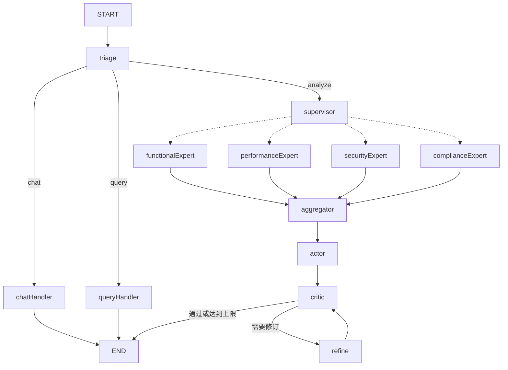
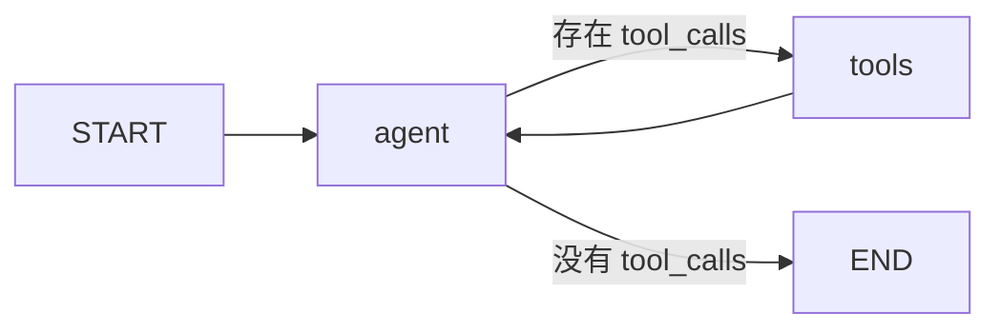

# LangGraph 核心知识点与常用使用流程

本文结合以下内容整理：

- 第八章：LangGraph 单 Agent 图实战——路由、循环与质量闭环
- 第九章：LangGraph Multi-Agent 实战
- `services/langGraph` 学习服务的实际代码
- `cursor_stategraph_creation_process.md` 中对 StateGraph 创建过程的分析

目标不是罗列 API，而是回答四个工程问题：

1. LangGraph 解决什么问题？
2. 一张图由什么组成？
3. 当前项目的主图和专家子图是怎样创建、连接和运行的？
4. 在真实项目中，应该按照什么流程设计、测试和上线 LangGraph？

---

## 1. LangGraph 的定位

LangChain 更擅长提供模型、Prompt、Tool、Retriever、Parser 等能力组件，以及使用 LCEL 构建线性调用链。

LangGraph 在这些组件之上提供一个有状态的图运行时，用来表达：

- 运行时条件路由；
- 多轮工具调用；
- 局部循环与返工；
- 多 Agent 调度；
- 并行分支和结果汇合；
- 节点级流式事件；
- 状态快照、暂停和恢复；
- Human-in-the-Loop；
- 长任务和组合式工作流。

一句话概括：

> LangGraph 使用 State 保存上下文，使用 Node 表达业务步骤，使用 Edge 表达控制流，再通过条件边、回边、子图、并行和 Checkpointer 构建可路由、可循环、可恢复的 Agent 工作流。

简单直线流程不一定需要 LangGraph；当流程出现路由、循环、并行、人工介入、断点恢复或多 Agent 协作时，图结构的价值才会明显体现。

---

## 2. 当前项目创建了多少张图

当前 `services/langGraph` 实际编译了五个图实例：

```text
1 张 RequirementState 主图
+ 4 张 ExpertState 专家 ReAct 子图
= 5 张 CompiledStateGraph
```

从架构层次看，它们属于两类图：

1. 主图：负责宏观业务编排；
2. 专家子图：负责某个专家内部的工具调用循环。

### 2.1 图的创建时序

```text
main.ts
  ↓
createLearningModel()
  ↓
createRequirementGraph(model)
  ├─ createRequirementNodes(model)
  │    ├─ createExpertGraph(functional)  → 功能专家子图
  │    ├─ createExpertGraph(performance) → 性能专家子图
  │    ├─ createExpertGraph(security)    → 安全专家子图
  │    └─ createExpertGraph(compliance)  → 合规专家子图
  │
  └─ buildRequirementGraph(nodes)
       └─ 创建并编译 RequirementState 主图
```

四张专家子图在 `createRequirementNodes()` 执行时就已经完成编译。它们被各专家包装节点通过闭包保存，后续每次 `graph.invoke()` 都复用这些子图，不会在每轮工具调用时重新创建。

### 2.2 主图结构



主图负责：

- 判断用户意图；
- 选择分析专家；
- 并行调度专家；
- 汇总专家结论；
- 生成综合报告；
- 评审和修订报告；
- 根据条件决定何时结束。

### 2.3 专家子图结构

四个专家的拓扑相同：



不同专家之间只有三个差异：

- System Prompt；
- 可使用的工具集合；
- 最终写入主图的结果字段。

---

## 3. State：图的数据契约

State 是整张图共享的数据上下文。节点之间不应依赖隐式全局变量，而应通过 State 读取输入、写入结果。

### 3.1 主图 State

当前主图包含四类字段：

```text
输入字段：
  input

路由字段：
  intent
  activeExperts

过程结果：
  functionalAnalysis
  performanceAnalysis
  securityAnalysis
  complianceAnalysis
  analysisResult

输出与循环字段：
  summary
  critique
  reviseCount
```

示例：

```ts
export const RequirementState = Annotation.Root({
  input: Annotation<string>({
    reducer: (_previous, next) => next,
    default: () => "",
  }),
  intent: Annotation<"chat" | "query" | "analyze">({
    reducer: (_previous, next) => next,
    default: () => "analyze",
  }),
  activeExperts: Annotation<ExpertName[]>({
    reducer: (_previous, next) => next,
    default: () => [],
  }),
  summary: Annotation<string>({
    reducer: (_previous, next) => next,
    default: () => "",
  }),
});
```

### 3.2 专家 State

专家子图只保留 ReAct 所需的局部上下文：

```ts
export const ExpertState = Annotation.Root({
  ...MessagesAnnotation.spec,
  toolRounds: Annotation<number>({
    reducer: (_previous, next) => next,
    default: () => 0,
  }),
});
```

其中：

- `messages` 累积 AIMessage 和 ToolMessage；
- `toolRounds` 限制工具循环次数。

主图不保存专家内部的完整消息轨迹，从而避免多个并行专家之间互相污染上下文。

### 3.3 Reducer

Reducer 决定一个节点返回的新值如何与旧 State 合并。

#### 覆盖型

```ts
summary: Annotation<string>({
  reducer: (_previous, next) => next,
  default: () => "",
})
```

适用于：

- 当前意图；
- 当前报告；
- 当前评审意见；
- 当前修订次数；
- 当前专家列表。

#### 追加型

`MessagesAnnotation` 使用追加型 reducer，适用于：

- 对话消息；
- 工具调用轨迹；
- 日志；
- 反思记录。

#### 对象合并型

Plan-and-Execute 常使用：

```ts
stepResults: Annotation<Record<string, string>>({
  reducer: (previous, next) => ({ ...previous, ...next }),
  default: () => ({}),
})
```

### 3.4 并发 State 设计原则

并行节点应尽量写不同字段：

```text
functionalExpert  → functionalAnalysis
performanceExpert → performanceAnalysis
securityExpert    → securityAnalysis
complianceExpert  → complianceAnalysis
```

不要让多个专家并发写同一个 `analysisResult`，也不要依赖“最后一个写入者是谁”。如果确实需要写同一字段，必须设计与业务语义一致的 reducer。

---

## 4. Node：图中的一步任务

Node 本质上是一个普通函数：

```ts
type RequirementNode = (
  state: RequirementGraphState,
) => RequirementGraphUpdate | Promise<RequirementGraphUpdate>;
```

节点应遵守以下规则：

1. 从 State 读取所需数据；
2. 完成一个相对明确的职责；
3. 只返回需要更新的字段；
4. 不返回完整 State；
5. 外部调用失败时提供合理降级。

正确示例：

```ts
async function securityExpertNode(state: RequirementGraphState) {
  const result = await runSecurityAnalysis(state.input);
  return { securityAnalysis: result };
}
```

不推荐：

```ts
return {
  ...state,
  securityAnalysis: result,
};
```

LangGraph 会根据 State reducer 自动合并局部更新。

---

## 5. Edge：图的控制流

### 5.1 普通边

普通边表达固定执行顺序：

```ts
.addEdge(START, "triage")
.addEdge("aggregator", "actor")
.addEdge("actor", "critic")
.addEdge("refine", "critic")
```

含义是前一个节点完成后，一定进入后一个节点。

### 5.2 条件边

条件边根据当前 State 选择路径：

```ts
function routeByIntent(state: RequirementGraphState) {
  if (state.intent === "chat") return "chatHandler";
  if (state.intent === "query") return "queryHandler";
  return "supervisor";
}
```

装配：

```ts
.addConditionalEdges("triage", routeByIntent, {
  chatHandler: "chatHandler",
  queryHandler: "queryHandler",
  supervisor: "supervisor",
})
```

### 5.3 回边

LangGraph 的循环由一条边指回前序节点形成。

ReAct 回边：

```text
tools → agent
```

Critic-Refine 回边：

```text
refine → critic
```

每个回边都必须具备：

- 明确退出条件；
- 循环计数器；
- 强制硬上限。

---

## 6. ReAct 工具循环

ReAct 的核心是让模型交替执行：

```text
Reasoning → Acting → Observation → Reasoning
```

在 LangGraph 中对应：

```text
agent → tools → agent
```

### 6.1 Agent 节点

Agent 判断是否需要调用工具：

```ts
const runnable =
  state.toolRounds >= maxToolRounds
    ? model
    : model.bindTools?.(tools);

const response = await runnable.invoke([
  systemMessage,
  ...state.messages,
]);

return { messages: [response] };
```

达到工具轮次上限后解除工具绑定，强制模型基于已有观察生成结论。

### 6.2 ToolNode

ToolNode 负责读取 AIMessage 中的 `tool_calls`，找到对应工具并执行，再写入 ToolMessage。

```ts
const toolNode = new ToolNode(tools);

async function toolsNode(state: typeof ExpertState.State) {
  const result = await toolNode.invoke(state);
  return {
    messages: result.messages ?? [],
    toolRounds: state.toolRounds + 1,
  };
}
```

### 6.3 循环路由

```ts
function routeAfterAgent(state: typeof ExpertState.State) {
  const last = state.messages.at(-1);
  const toolCalls =
    last && "tool_calls" in last
      ? last.tool_calls
      : undefined;

  return Array.isArray(toolCalls) && toolCalls.length > 0
    ? "tools"
    : "done";
}
```

---

## 7. 子图与主图的连接方式

### 7.1 State 相同时

如果主图和子图使用相同 State Schema，可以直接挂载编译后的子图：

```ts
.addNode("analysis", compiledSubgraph)
```

### 7.2 State 不同时

当前项目的主图和专家图 State 不兼容，因此使用包装节点手工映射：

```ts
async function securityExpertNode(mainState: RequirementGraphState) {
  const subResult = await securityGraph.invoke({
    messages: [new HumanMessage(mainState.input)],
    toolRounds: 0,
  });

  const content = getLastAIText(subResult.messages);

  return {
    securityAnalysis: content,
  };
}
```

完整映射过程：

```text
主图 input
  ↓ 包装为 HumanMessage
专家子图 messages
  ↓ agent ↔ tools
子图最终 AIMessage
  ↓ 提取字符串
主图 securityAnalysis
```

包装层还承担错误降级：

```ts
try {
  const result = await runExpertGraph(...);
  return { securityAnalysis: result };
} catch (error) {
  return {
    securityAnalysis: "[安全专家暂不可用，建议人工补充]",
  };
}
```

---

## 8. Supervisor、并行和 Aggregator

### 8.1 Supervisor

Supervisor 只负责选择专家，不负责完成专业分析。

结构化输出示例：

```ts
{
  experts: ["functional", "security", "compliance"],
  reason: "需求涉及敏感个人信息和跨境处理"
}
```

常见选择规则：

- 所有需求至少选择 functional；
- 批量、大文件、高并发选择 performance；
- 登录、权限、敏感数据选择 security；
- 个人信息、跨境、金融、医疗选择 compliance。

### 8.2 Fan-out 并行分发

条件路由返回数组时，LangGraph 会并行调度多个目标节点：

```ts
function routeToExperts(state: RequirementGraphState) {
  return state.activeExperts.map(
    (expert) => EXPERT_NODE_MAP[expert],
  );
}
```

可能返回：

```ts
[
  "functionalExpert",
  "securityExpert",
  "complianceExpert",
]
```

### 8.3 Fan-in 汇合

所有专家节点指向 Aggregator：

```ts
.addEdge("functionalExpert", "aggregator")
.addEdge("performanceExpert", "aggregator")
.addEdge("securityExpert", "aggregator")
.addEdge("complianceExpert", "aggregator")
```

Aggregator 读取实际启用的专家结果并写入统一字段：

```ts
return {
  analysisResult: parts.join("\n\n---\n\n"),
};
```

---

## 9. Critic-Refine 质量闭环

Critic-Refine 解决的是“信息已经足够，但生成结果质量不稳定”的问题。

```text
actor → critic
          ├─ 通过 → END
          └─ 不通过 → refine → critic
```

节点职责：

- `actor`：生成初版综合报告；
- `critic`：按照客观标准评审；
- `refine`：只修订被指出的问题。

路由函数：

```ts
function routeAfterCritic(state: RequirementGraphState) {
  if (!state.critique.trim()) return "done";
  if (state.reviseCount >= 2) return "done";
  return "refine";
}
```

评审标准应尽量客观，例如：

- 是否包含需求摘要；
- 是否包含风险和冲突；
- 是否有实施建议；
- 是否有验收标准；
- 是否存在前后矛盾。

避免使用“语言是否优美”“是否足够完美”这类难以收敛的主观标准。

---

## 10. Compile 与运行生命周期

`StateGraph` 是构建器，调用 `compile()` 后才得到可执行图。

```ts
const graph = new StateGraph(RequirementState)
  .addNode(...)
  .addEdge(...)
  .addConditionalEdges(...)
  .compile();
```

推荐生命周期：

```text
服务启动
  ↓
创建模型
  ↓
创建并编译子图
  ↓
创建并编译主图
  ↓
复用 CompiledGraph 处理多次请求
```

不要在每个节点内部重新创建整张主图，也不要在每次工具循环时重新编译专家图。

常用运行 API：

```ts
await graph.invoke(input);
await graph.stream(input);
graph.streamEvents(input);
await graph.getState(config);
await graph.updateState(config, patch);
```

---

## 11. 普通调用与流式调用

### 11.1 invoke

```ts
const result = await graph.invoke({
  input: "分析 REQ-001",
});
```

适合：

- 只关心最终结果；
- 离线任务；
- 单元测试；
- 服务端同步接口。

`invoke()` 在整张图完成后才返回，因此执行期间默认没有节点级反馈。

### 11.2 streamMode: updates

```ts
const stream = await graph.stream(
  { input },
  { streamMode: "updates" },
);

for await (const update of stream) {
  console.log(update);
}
```

每个节点完成后返回其 State 增量，适合步骤进度条。

### 11.3 streamEvents

```ts
const events = graph.streamEvents(
  { input },
  { version: "v2" },
);

for await (const event of events) {
  if (event.event === "on_chat_model_stream") {
    // 模型 token
  }
  if (event.event === "on_tool_start") {
    // 工具开始
  }
}
```

适合观察：

- 节点开始和结束；
- 模型 token；
- 工具调用；
- 子图内部执行；
- 并行专家时间线。

---

## 12. Checkpointer 与 HITL

Checkpointer 保存的是图的节点级 State 快照，不等于普通聊天记录。

编译：

```ts
const graph = builder.compile({
  checkpointer,
  interruptBefore: ["actor"],
});
```

执行时必须携带稳定的 `thread_id`：

```ts
const config = {
  configurable: {
    thread_id: "user-1:analysis-001",
  },
};
```

暂停和恢复流程：

```text
invoke()
  ↓ 到达 interruptBefore
暂停并保存 State
  ↓
getState()
  ↓ 人工检查
updateState()
  ↓ 写入补丁
invoke(null)
  ↓ 从断点继续
```

开发环境可以使用 `MemorySaver`。生产环境通常替换为持久化 Saver，并建立 thread 清理和归档策略。

HITL 的完整组成包括：

```text
Checkpointer
+ thread_id
+ interrupt / interruptBefore
+ getState / updateState
+ resume
```

只有前端确认弹窗而没有真实图暂停，不属于图级 HITL。

---

## 13. 常用 LangGraph 模式

| 模式 | 解决的问题 | 典型结构 |
| --- | --- | --- |
| Router/Triage | 请求应该走哪条路径 | `router → A/B/C` |
| ReAct | 信息不足，需要调用工具 | `agent → tools → agent` |
| Supervisor | 多专家中心化调度 | `supervisor → experts → aggregator` |
| Handoff | Agent 之间直接交接控制权 | `agent A → agent B` |
| Critic-Refine | 局部内容质量不合格 | `critic → refine → critic` |
| Plan-and-Execute | 大任务先拆分再逐步执行 | `planner → executor` |
| Reflexion | 整体计划或执行路径需要重跑 | `evaluator → reflector → executor` |
| HITL | 关键节点等待人工审批 | `interrupt → update → resume` |

三类循环需要重点区分：

```text
ReAct：
  tools → agent
  目的：获取更多外部信息

Critic-Refine：
  refine → critic
  目的：局部提高内容质量

Reflexion：
  reflector → executor
  目的：修改计划并重跑整体任务
```

---

## 14. 标准开发流程

### 第一步：画业务流程

先回答：

- 请求有几种类型？
- 哪些步骤一定执行？
- 哪些步骤条件执行？
- 哪些步骤可以并行？
- 哪些步骤需要循环？
- 哪里需要人工介入？
- 最终输出字段是什么？

### 第二步：设计 State

按类别定义字段：

```text
输入字段
路由字段
中间结果
最终结果
循环计数
错误和降级信息
```

为每个字段选择正确 reducer 和 default。

### 第三步：实现节点

先实现纯节点函数，确保：

- 单一职责；
- 局部更新；
- 结构化输出；
- 错误降级；
- 可以独立测试。

### 第四步：定义工具

工具必须具备：

- 清晰名称；
- 明确 description；
- 严格参数 Schema；
- 可读返回值；
- 超时和异常处理；
- 外部副作用幂等性。

### 第五步：把局部循环封装成子图

适合子图的场景：

- ReAct 工具循环；
- Critic-Refine；
- 某个专业领域；
- 可独立测试的复杂流程；
- 需要局部 State 的工作流。

### 第六步：定义主图和子图契约

明确：

- 主图传给子图什么；
- 子图返回主图什么；
- 是否共享 State；
- 是否需要包装节点；
- 是否需要隔离 messages。

### 第七步：装配图

推荐顺序：

```ts
const builder = new StateGraph(State);

builder.addNode(...);
builder.addEdge(START, ...);
builder.addConditionalEdges(...);
builder.addEdge(..., END);

const graph = builder.compile();
```

### 第八步：使用 invoke 验证结果

验证：

- 最终 State 是否正确；
- 不同意图是否走不同路径；
- 子图结果是否正确写回主图。

### 第九步：使用 stream 验证路径

观察：

- 实际执行了哪些节点；
- 专家是否并行；
- 是否出现多余路径；
- 循环是否在硬上限内结束。

### 第十步：加入 Checkpointer 与 HITL

只有需要暂停恢复、长任务续跑或人工审批时再启用，避免和业务数据库形成无意义的双重存储。

### 第十一步：加入错误降级和成本上限

典型硬上限：

- 专家工具轮数；
- Critic-Refine 修订次数；
- Reflexion 整体重跑次数；
- Supervisor 最大专家数；
- 单节点超时；
- 单请求 token 预算。

### 第十二步：测试图拓扑

将真实节点创建和图拓扑分开：

```text
createRequirementNodes(model)
  负责真实模型和工具节点

buildRequirementGraph(nodes)
  负责拓扑、路由、并行和回边
```

测试时注入确定性节点：

```ts
const graph = buildRequirementGraph(mockNodes);
```

这样不需要 API Key 也能验证图结构。

---

## 15. 常见问题排查

### 15.1 invoke 长时间没有输出

`invoke()` 只在整图结束后返回。使用 `streamMode: "updates"` 查看节点完成事件，使用 `streamEvents()` 查看节点开始、模型和工具事件。

### 15.2 图进入无限循环

检查：

- 是否存在回边；
- 是否有计数器；
- 是否有硬上限；
- 模型是否重复调用同一个工具；
- Critic 标准是否过严。

### 15.3 Supervisor 没有选择专家

检查：

- Schema 是否设置 `.min(1)`；
- Prompt 是否明确专家选择条件；
- `activeExperts` 是否写回 State；
- 条件路由是否返回有效节点名。

### 15.4 并行没有生效

确认条件路由返回数组：

```ts
return ["functionalExpert", "securityExpert"];
```

### 15.5 专家消息相互污染

不要让所有并发专家共享同一个主图 messages。推荐每个专家使用独立 ExpertState，只将最终业务结果写回主图。

### 15.6 Aggregator 收不到结果

检查：

- 专家是否写入正确字段；
- 专家节点是否连接到 Aggregator；
- Aggregator 是否根据 `activeExperts` 读取结果；
- 字段 reducer 是否正确；
- 专家是否因为异常返回了空字符串。

### 15.7 Checkpointer 无法恢复

检查：

- 编译时是否传入 Checkpointer；
- 多次调用是否使用同一个 `thread_id`；
- MemorySaver 实例是否被重复创建；
- 是否使用 `invoke(null, config)` 恢复。

---

## 16. 当前项目验证命令

无需 API Key 的结构测试：

```bash
bun run test:langgraph
```

普通模型调用：

```bash
bun run demo:langgraph
```

节点级流式调用：

```bash
bun --cwd services/langGraph demo:stream "你好"
```

HITL 示例：

```bash
bun --cwd services/langGraph demo:hitl
```

当前测试覆盖：

- chat/query 短路；
- Supervisor 专家并行；
- 独立字段写入与 Aggregator 汇合；
- Critic-Refine 收敛；
- updates 流实际路径；
- Checkpointer 暂停、更新和恢复。

---

## 17. 设计原则总结

1. 主图负责宏观业务编排，子图负责局部复杂行为。
2. State 是节点之间唯一明确的数据契约。
3. Node 只返回局部更新，Reducer 决定合并语义。
4. 普通边表达固定顺序，条件边表达路由，回边表达循环。
5. 条件路由返回数组可以表达图原生并行。
6. 子图 State 与主图不兼容时，使用包装节点做输入输出映射。
7. 并发专家应写独立结果字段，不依赖写入顺序。
8. 每个循环都必须有业务退出条件和硬上限。
9. 图在构建期编译一次，在运行期重复调用。
10. 业务聊天记录与 LangGraph Checkpoint 是两种不同的持久化数据。
11. 单个专家失败应降级为部分结果，而不是拖垮整张图。
12. 测试应把图拓扑与真实模型节点分离，避免依赖 API Key。

LangGraph 的核心价值不是“把代码画成图”，而是让本来已经复杂的 Agent 控制流具备清晰的数据契约、显式的执行路径、可控的循环、可靠的并行和可恢复的运行状态。
