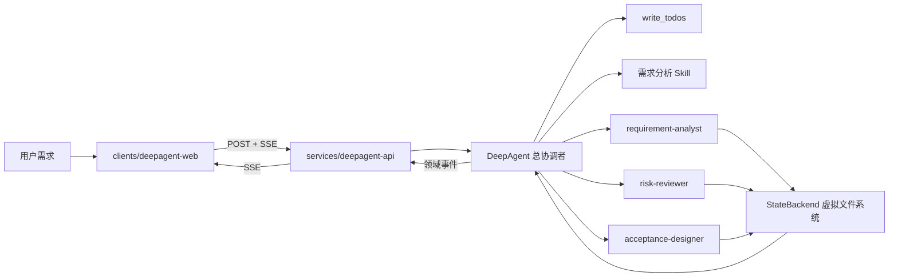

# DeepAgent-first：在全新目录中直接实现需求分析 Agent

> 配套复习资料：[DeepAgent API 知识点总结](./deepagent-api-knowledge-summary.md)。该文档按当前代码归纳架构、运行时、SubAgent、虚拟文件、SSE、稳定性护栏和调试经验；本文继续保留从零实施步骤。

本文是当前仓库的 **DeepAgent-first 工程实践线**。它与《AI Agents 开发实践》的教材路线互补，但不改变教材本身：

- 教材路线继续按 LangChain 与向量基础 → LangGraph → RAG → MCP/Skills → DeepAgent 的章节顺序讲清底层原理与迁移过程。
- 当前工程不先复制一套手写 Chain、StateGraph 或旧编排器，而是在全新目录中直接用 `createDeepAgent` 组装需求分析 Agent。

这里的 “DeepAgent-first” 并不是“不使用 LangChain/LangGraph”。DeepAgent 本身建立在它们之上；这里省略的是**先手写底层运行时、再把它替换成 Harness**的重复工程过程。

> 重要边界：本指南不修改 `docs/AI Agents 开发实践/**`，新工程也不复用 `services/chat/src`、`services/api/src` 或 `clients/chat-web` 的业务实现。共享的 Bun workspace、Turbo 配置和基础设施可以继续使用。

## 1. 最终要得到什么

当前场景是 Autix 的“需求分析工作台”。用户提交一段产品或软件需求后，系统应当逐步完成：

1. 总协调 Agent 建立 todo 计划。
2. 将完整性与复杂度分析委派给需求分析专家。
3. 将技术、数据、安全和交付风险委派给风险专家。
4. 将正常、异常、权限、边界和非功能场景委派给验收专家。
5. 把大段中间结果写入虚拟文件系统，而不是反复堆进主对话。
6. 重新读取专家产物，生成一份可评审、可开发、可测试的最终报告。
7. 通过稳定的 SSE 协议把进度、产物和结果传给新的 Web 工作台。



本轮的目标是一个**隔离、可测试的 DeepAgent MVP**。数据库、真实向量检索、跨进程恢复、登录鉴权、HITL、生产观测与评估门禁属于后续阶段；在相应代码和测试完成前，不把它们标记为已实现。

## 2. 新旧工程边界

### 2.1 新目录

```text
clients/
└─ deepagent-web/                 # 新的 Next.js 工作台，默认端口 3100
   ├─ app/                        # layout、page 与全局样式
   ├─ components/
   │  └─ agent-workbench.tsx      # 输入、运行轨迹、产物和报告
   └─ lib/
      └─ agent-api.ts             # SSE 请求、增量解析与协议校验

services/
└─ deepagent-api/                 # 新的 NestJS API，默认端口 4100
   ├─ skills/
   │  └─ requirement-analysis/    # SKILL.md、评分表与报告模板
   ├─ src/
   │  ├─ agent/
   │  │  ├─ agent.factory.ts      # createDeepAgent 唯一组装入口
   │  │  ├─ deepagent.runtime.ts  # v2 raw-event 适配与最终硬校验
   │  │  ├─ agent.service.ts      # run/thread 信封与错误收口
   │  │  ├─ agent.controller.ts   # info 与 SSE HTTP 接口
   │  │  ├─ skill-files.ts        # 版本化 Skill → StateBackend
   │  │  ├─ prompts/              # 总协调者约束
   │  │  ├─ subagents/            # 三个专职 Subagent
   │  │  ├─ tools/                # 确定性业务工具
   │  │  └─ types.ts              # 运行时内部类型
   │  └─ health/                  # 健康检查
   └─ test/                       # 离线、协议、架构边界测试

packages/
└─ deepagent-contracts/           # API 与 Web 共用的请求/SSE 协议
```

根 `package.json` 已采用 `clients/*`、`services/*`、`packages/*` workspace 通配规则，因此新目录可以作为独立 workspace 接入，不必把代码塞回原服务。

### 2.2 可以共享什么

可以共享的是没有业务耦合的工程资源，例如：

- Bun workspace 与锁文件；
- Turbo 的 build/typecheck/lint 任务；
- TypeScript 基础配置；
- 后续需要时复用 `infra/` 中的 PostgreSQL/pgvector 容器。

默认不共享的是旧应用内部实现：

- 不从 `services/chat/src/**` 导入旧的 LangChain/LangGraph 编排；
- 不从 `services/api/src/**` 搬控制器或业务服务；
- 不让新 Web 依赖 `clients/chat-web/**`；
- 不直接复用旧 UI 协议后再被历史字段约束。

因此本工程新建了 `@autix/deepagent-contracts`。即使字段看起来相似，也先让新协议表达 DeepAgent 的 todo、subagent、artifact 和流式生命周期；真正稳定且通用后，再考虑上移为公共包。

## 3. 一次请求怎样流动

完整调用链分成四层：

| 层 | 负责什么 | 不负责什么 |
| --- | --- | --- |
| Web | 收集输入、消费 SSE、展示进度与报告 | 不解析 LangChain 内部事件，不决定 Agent 路由 |
| Nest API | 校验请求、创建 run/thread、规范化流式事件 | 不手写需求分析工作流 |
| DeepAgent Harness | 规划、委派、文件管理、上下文控制、最终汇总 | 不把确定性规则伪装成模型推理 |
| Tools/Skills/Subagents | 提供事实、方法和专门判断 | 不绕过总协调者直接控制 HTTP 响应 |

这个分层有两个直接收益：

1. 前端只依赖稳定的领域事件。以后升级 DeepAgent 或更换底层事件名，不需要重写 UI。
2. 确定性计算放在工具里，模型负责理解、取舍与表达，测试时可以分别验证。

## 4. Step 0：先恢复干净边界

开始新实现前，先确认上一次中断时对旧目录做的 DeepAgent 改造已经撤销：

```powershell
git status --short
```

检查重点：

- `services/chat/**` 不应因为本次 DeepAgent-first 工作继续产生修改；
- 原先临时加入旧服务的 `deep-agent` 目录、适配器和测试不应继续存在；
- 新增代码只应出现在 `services/deepagent-api`、`clients/deepagent-web`、`packages/deepagent-contracts` 以及本指南中；
- 根 workspace/README 的少量接线和说明可以修改。

不要为了得到“干净状态”而无差别恢复整个工作区。仓库里可能有用户自己的未提交内容；只撤销已确认来自上一次中断的文件。

## 5. Step 1：创建三个独立 workspace

### 5.1 共享协议包

`packages/deepagent-contracts` 是 API 和 Web 之间唯一的协议入口。第一版协议包含：

- `AgentRunRequestSchema`：`input` 必填，`threadId` 可选；
- `run.started`：服务端已经接收请求并分配 run；
- `progress`：某个 Agent 或工具开始、完成或失败；
- `artifact`：虚拟文件系统中的阶段产物；
- `final`：最终报告、todos、使用过的专家和工具；
- `error`：可公开给调用方的错误码与消息；
- `done`：服务端有机会正常收口时的传输结束；客户端主动取消可能直接断开，不再收到它。

协议用 Zod 定义而不是只写 TypeScript interface，原因是 HTTP 输入和 SSE 数据都来自运行时，必须真正校验。共享包还提供 SSE 编码函数，确保所有事件遵守相同 framing。

建议始终保持这个约束：**DeepAgent 原始事件只存在于 API 内部，跨网络传输的一定是领域事件。**

### 5.2 Nest API

`services/deepagent-api` 使用自己的包名、环境变量和端口：

```dotenv
PORT=4100
OPENAI_API_KEY=
OPENAI_BASE_URL=
DEEPAGENT_MODEL=gpt-5.4
DEEPAGENT_RECURSION_LIMIT=80
```

`OPENAI_BASE_URL` 用于 OpenAI-compatible provider。`DEEPAGENT_MODEL` 必须支持 tool calling；不支持工具调用的模型无法可靠使用 `write_todos`、`task` 和文件工具。

### 5.3 Next.js Web

`clients/deepagent-web` 使用独立端口 `3100`。浏览器默认请求同源 `/api`，Next
服务端再代理到本机 `4100`：

```dotenv
NEXT_PUBLIC_API_BASE_URL=
DEEPAGENT_API_INTERNAL_URL=http://localhost:4100
```

独立端口允许教材配套应用和新工作台同时运行，便于比较两条工程路线，而不会互相覆盖。

### 5.4 验收

在仓库根目录执行：

```powershell
bun install
bun run --filter @autix/deepagent-contracts typecheck
bun run --filter @autix/deepagent-api typecheck
bun run --filter @autix/deepagent-web typecheck
```

根脚本也提供了常用入口：`bun run dev`（同时启动新 API 与 Web）、`bun run test:deepagent` 和 `bun run build:deepagent`。过滤单个 workspace 的命令更适合定位问题，根脚本更适合日常联调。

某个 workspace 尚未完成创建时，对应命令会失败或找不到包；这表示该步骤仍未完成，不应跳过后直接标记成功。

## 6. Step 2：先实现确定性工具

当前 MVP 提供两个无需模型即可验证的工具：

### `analyze_completeness`

按六个维度检查需求文本：

1. 用户与场景；
2. 目标与价值；
3. 功能范围；
4. 验收标准；
5. 非功能要求；
6. 边界与例外。

工具返回覆盖项、缺失项、待澄清问题和 0–100 分。它不是为了取代产品经理，而是给 Agent 一个稳定、可重复的基线。

### `estimate_complexity`

根据文本长度和外部系统、批处理、安全、性能、AI 非确定性等因素给出 `S/M/L/XL` 与开发天数区间。

这仍是教学用启发式估算，不是排期承诺。最终报告应当明确说明估算依据，缺少团队规模、历史速度或系统现状时不能伪装成精确结论。

### 为什么先写工具

如果把完整性评分和复杂度映射全部写进 prompt，同一个输入可能得到完全不同的数字，也很难写离线单元测试。现在的分工是：

- 工具产生可复现的基础事实；
- Subagent 解释事实、发现规则没有覆盖的语义问题；
- 总协调者合并不同专家意见。

对应实现位于 `services/deepagent-api/src/agent/tools/requirement.tools.ts`。

## 7. Step 3：定义 Skill，而不是继续加长 prompt

需求分析资产位于 `services/deepagent-api/skills/requirement-analysis`。运行时需要将它映射到下面的虚拟目录：

```text
/skills/requirement-analysis/
├─ SKILL.md
├─ references/
│  └─ scoring-rubric.md
└─ assets/
   └─ report-template.md
```

拆分原则：

- `SKILL.md` 只保留适用场景、执行顺序、需要读取的参考资料和交付标准；
- 详细评分规则放 `references/`，需要时再读取；
- 稳定的报告结构放 `assets/`；
- 可以由程序精确完成的事情继续放 Tool，不要写成自然语言规则。

DeepAgent 的 Skills 通过 backend 暴露的文件读取，而不是 Node.js import。自定义 Subagent 默认不会自动继承父 Agent 的 Skills，因此需要在 Subagent 配置中显式声明 `skills: ["/skills/"]`。只有运行时确实把对应文件装入 backend 后，这项能力才算接通。

本工程由 `skill-files.ts` 在每次运行开始时读取上述三个版本化文件，再放入 StateBackend 的 `/skills/requirement-analysis/**`。这样既没有把整个宿主机目录暴露给模型，也能让离线测试精确提供相同的虚拟文件。

## 8. Step 4：建立三个窄职责 Subagent

`services/deepagent-api/src/agent/subagents/requirement.subagents.ts` 定义三个专家：

| Subagent | 职责 | 工具/上下文边界 | 预期产物 |
| --- | --- | --- | --- |
| `requirement-analyst` | 完整性、范围、澄清问题、复杂度 | 可调用两个确定性工具并读取 Skill | `requirement-analysis.md` |
| `risk-reviewer` | 技术、数据、安全、进度、依赖和歧义风险 | 独立审查，不负责最终定稿 | `risk-review.md` |
| `acceptance-designer` | Given-When-Then 验收与边界测试 | 读取 Skill，覆盖正常和失败路径 | `acceptance-criteria.md` |

Subagent 的价值不是“角色名称更多”，而是**上下文隔离和权限收窄**：每个专家只看到完成自己任务需要的信息和工具，主 Agent 最后接收浓缩结果。简单的一步问题不值得委派；本项目之所以适合，是因为三类分析可以独立产出大量中间材料。

### 只暴露三位专家：禁用自动 `general-purpose`

DeepAgent 的 OpenAI harness profile 可以自动加入一个 `general-purpose` Subagent。通用专家适合开放式任务，但本项目的交付契约要求完整性、风险和验收三个职责都被独立执行；如果还暴露通用专家，模型可能把任务委派给它，从而绕过具名专家的最小工具集和质量边界。

因此 `agent.factory.ts` 在创建 Agent 前注册下面的 profile：

```ts
registerHarnessProfile("openai", {
  generalPurposeSubagent: { enabled: false },
});
```

最终可调用的业务 Subagent 只有：

- `requirement-analyst`；
- `risk-reviewer`；
- `acceptance-designer`。

这不是关闭 DeepAgent 的 `task` 能力，而是让 `task` 只能在本项目明确声明、可以验收的专家集合中选择。

## 9. Step 5：组装 DeepAgent 总协调者

核心运行时应直接调用 `createDeepAgent`，而不是先建立一张业务 `StateGraph`。组装要素如下：

```ts
const agent = createDeepAgent({
  model,
  systemPrompt: COORDINATOR_PROMPT,
  tools: requirementTools,
  subagents: requirementSubagents,
  skills: ["/skills/"],
  backend: new StateBackend(),
  permissions: [
    { operations: ["read"], paths: ["/"] },
    { operations: ["read"], paths: ["/skills/**"] },
    { operations: ["read", "write"], paths: ["/work/**"] },
    { operations: ["read", "write"], paths: ["/**"], mode: "deny" },
  ],
});
```

这段代码背后的职责划分比代码本身更重要：

- `model`：完成理解、判断和生成，必须支持工具调用；
- `systemPrompt`：约束总目标、必做步骤、输出要求和禁止事项；
- `tools`：提供确定性业务能力；
- `subagents`：提供专门角色与隔离上下文；
- `skills`：提供可渐进加载的方法资产；
- `backend`：承载 Skill 和工作产物的虚拟文件系统。
- `permissions`：允许列出 VFS 根目录以发现可用目录，只读 `/skills/**`、允许读写
  `/work/**`，其余路径默认拒绝。这里的 `/` 是每次运行独立的 `StateBackend`
  虚拟根目录，不是宿主机文件系统。

总协调 prompt 当前要求：

1. 第一个动作是使用 `write_todos` 规划；
2. 使用 `task` 分别调用三个专家；
3. 把专家完整结果写入 `/work/*.md`；
4. 重新读取三个文件后生成 `/work/final-report.md`；
5. 最终回复包含摘要、评分、澄清问题、模块、风险、验收标准、复杂度和下一步；
6. 完成前把 todos 全部更新为 `completed`。

这是“模型可自主选择具体推理路径”和“业务交付标准不可省略”之间的平衡。Harness 管理循环，prompt 管理目标和边界，Tool 管理确定性事实。

### Prompt 之外再加最终硬校验

Prompt 表达的是模型**应该**完成什么，不能单独作为系统已经完成任务的证明。`deepagent.runtime.ts` 在发送 `final` 事件前还会执行程序化校验：

1. 三位具名专家都必须成功结束；只调用一位或用通用专家代替都不合格。
2. `/work` 中必须存在四份非空产物：
   - `/work/requirement-analysis.md`；
   - `/work/risk-review.md`；
   - `/work/acceptance-criteria.md`；
   - `/work/final-report.md`。
3. todo 列表不能为空，而且每一项的状态都必须是 `completed`。

任何一项不满足，运行时都会把协调者标记为 `failed` 并抛出错误，由 API 输出 `error → done`；它不会拿最后一条自然语言回复冒充合格的最终报告。`final.report` 只取已经通过校验的 `/work/final-report.md`。

### 开发阶段 backend

MVP 为每个 HTTP run 新建一个 `StateBackend`。它适合单次运行内的草稿和大工具结果外移，但不能被描述成会话或生产级持久化：

- 下一次请求即使复用同一个 `threadId`，当前实现也不会恢复 messages、files 或 todos；
- 跨 run 恢复至少需要持久化 checkpointer，并重新审视 backend/store 的生命周期；
- 进程重启后恢复需要持久化 checkpointer/store；
- 跨线程长期记忆更适合 StoreBackend 或自定义持久化 backend；
- HTTP 服务不应随意把宿主机目录暴露给 `FilesystemBackend`。

因此本轮只把 StateBackend 当作**可测试的单次 run 临时工作区**。

## 10. Step 6：用 v2 raw event 适配领域事件

DeepAgent/LangGraph 的 stream 会产生模型、工具和 Subagent 相关事件。API 不应把它们原样透传，而应转换成 `@autix/deepagent-contracts` 定义的有限事件集合。

### 为什么生产 runtime 不使用 v3 投影

DeepAgent 的 `streamEvents` 同时支持 v2 raw events 和更高层的 v3 投影。v3 可以直接消费 `output`、`toolCalls`、`subagents` 等投影，正常路径写起来更简洁；但本项目锁定的 `deepagents 1.10.2 + langchain 1.5.4` 组合在**重复 Subagent transformer 的失败路径**上存在兼容问题：

1. v3 会为同一次 Subagent 执行建立多个投影 Promise。
2. Subagent 失败时，业务层能够捕获主输出的异常，但另一个原生 transformer Promise 仍可能在应用不可访问的位置 rejected。
3. 即使外层 `try/catch` 已经返回了预期错误，Bun 仍会在事件循环末尾把这个 rejection 视为未处理异常，并以退出码 1 结束进程。

这不是“v3 在所有版本和所有场景都不可用”的结论，而是当前依赖组合上已经用真实失败路径复现的风险。生产服务因此采用官方支持的 v2 API：

```ts
const events = agent.streamEvents(initialState, {
  version: "v2",
  recursionLimit,
  configurable: { runId, threadId },
  signal,
});
```

v2 返回单一 raw-event AsyncIterable，应用在一个 `for await` 循环中统一处理：

- `on_chain_start`：识别根 Agent 与三位具名 Subagent，发出 started；
- `on_chain_end`：记录成功完成的专家，并从根 Agent 事件保存最终 state；
- `on_chain_error`：把对应专家映射为 failed；
- `on_tool_start`：结合 checkpoint namespace 记录工具属于协调者还是某位专家；
- `on_tool_end` / `on_tool_error`：发出 completed 或 failed。

因此切换到 v2 并没有牺牲前端进度：API 仍然输出同一套 `progress`、`artifact`、`final`、`error`、`done` 领域协议，只是内部投影方式更可控。将来升级依赖并确认 v3 的重复 Subagent 失败回归通过后，才应重新评估切回 v3。

一次成功运行的外部顺序应满足：

```text
run.started
  → progress (0..n)
  → artifact (0..n)
  → final
  → done
```

失败运行应满足：

```text
run.started
  → progress/artifact (0..n)
  → error
  → done
```

客户端取消时，连接可能在任意 progress/artifact 后直接关闭。此时服务端通过 `AbortSignal` 停止 DeepAgent，不保证再发送 `error` 或 `done`：

```text
run.started
  → progress/artifact (0..n)
  → client disconnect
```

关键规则：

- `runId` 标识一次执行；`threadId` 当前只是逻辑关联 ID，为以后接入 checkpointer 预留，不代表已经可以续跑；
- 每个事件带 ISO 时间戳；
- 未识别的内部事件默认忽略或记日志，不让前端崩溃；
- 服务端错误要映射为稳定错误码，不能把密钥、prompt 或堆栈发给浏览器；
- `done` 表示传输结束，`final` 表示存在业务结果。

这种适配层也让离线测试可以注入 fake runtime，验证 SSE 顺序而无需调用真实模型。

## 11. Step 7：提供 NestJS SSE 接口

新 API 的目标接口是：

| 方法 | 路径 | 作用 |
| --- | --- | --- |
| `GET` | `/health` | 验证服务进程可用，不验证模型供应商 |
| `GET` | `/api/agent/info` | 查看架构、backend、持久化边界与已声明的专家 |
| `POST` | `/api/agent/runs/stream` | 校验输入并以 SSE 返回执行过程 |

启动服务。若 `services/chat/.env` 已经配置了模型，可把其中的
`OPENAI_API_KEY`、`OPENAI_BASE_URL` 复制到新服务，并将 `OPENAI_MODEL`
的值用作 `DEEPAGENT_MODEL`；不要复制 Chat 的 `PORT=4001`，新 API 使用
`4100`：

```powershell
Copy-Item services/deepagent-api/.env.example services/deepagent-api/.env
bun run dev:deepagent-api
```

需要同时启动 API 与 Web 时，可在根目录直接执行 `bun run dev`。

健康检查：

```powershell
curl.exe --fail-with-body http://localhost:4100/health
```

配置真实模型后，可选执行流式 smoke test：

```powershell
curl.exe -N -X POST http://localhost:4100/api/agent/runs/stream `
  -H "Content-Type: application/json" `
  -d '{"input":"作为运营人员，我需要批量导入 Excel 客户资料；必须校验重复邮箱，失败行可下载，操作需要审计。","threadId":"demo-001"}'
```

如果没有 API Key，健康检查和离线测试仍应可运行；真实模型 smoke test 属于显式的联网验收，不能用离线 fake model 的结果代替。

## 12. Step 8：建立新的 Web 工作台

`clients/deepagent-web` 只依赖新 API 和 `@autix/deepagent-contracts`，主要职责是：

1. 输入需求和可选 thread ID；
2. 提供示例输入、新会话和取消当前运行；
3. 发起 `POST /api/agent/runs/stream`；
4. 增量解析 SSE，并用共享 Zod schema 校验，而不是等待完整 JSON；
5. 实时展示专家与工具进度，并在 `final` 到达后展示 todos；
6. 展示 artifact、工具轨迹和最终 Markdown 原文报告；
7. 显示可理解的 error/done/提前断流状态，同时保留重新运行入口；
8. 对未知或不符合 schema 的事件立即停止并显示协议错误，避免静默使用损坏数据。

“取消”不是只改前端按钮状态：浏览器会中止 fetch，Nest 控制器监听连接关闭，并把同一个 `AbortSignal` 传入 DeepAgent 运行配置，避免客户端离开后模型仍在后台继续消耗资源。

协议错误和正常 `done` 也会主动结束底层流：

- 收到 `done` 后，SSE 客户端调用 `reader.cancel()` 并立即返回，不继续等待服务器连接；
- JSON 无法解析、事件不符合共享 Zod schema，或事件消费者抛错时，客户端先取消 reader，再把错误交给页面显示；
- 仅调用 `releaseLock()` 不会中止 fetch，因此这里必须显式 cancel，连接关闭才能继续向 Nest 的 `AbortSignal` 传播。

启动：

```powershell
bun run dev:deepagent-web
```

然后访问 <http://localhost:3100>。浏览器默认请求同源 `/api`，由 Next 服务端代理到
`DEEPAGENT_API_INTERNAL_URL`（默认 <http://localhost:4100>）；这样通过 Network
地址打开页面时，浏览器不会错误地连接自己所在设备的 `localhost:4100`。需要让浏览器
直接请求另一个公开 API 时，再设置 `NEXT_PUBLIC_API_BASE_URL`。

如果通过开发机的 Network 地址访问（例如 `http://172.5.204.37:3100`），需要把
该主机加入 `clients/deepagent-web/.env`：

```dotenv
NEXT_ALLOWED_DEV_ORIGINS=172.5.204.37
```

修改 Next 配置后重启开发服务。若页面底部的会话一直显示“准备中”，通常表示
浏览器 JavaScript 尚未完成加载；先检查终端是否出现 `Blocked cross-origin request`。

API 默认输出不含需求正文和报告正文的安全进度日志，例如：

```text
[AgentService] [run:...] started thread=... inputChars=65
[AgentService] [run:...] progress agent=coordinator status=started
[AgentService] [run:...] progress agent=requirement-analyst tool=read_file status=started
[AgentService] [run:...] artifact path=/work/final-report.md chars=...
[AgentService] [run:...] final agents=3 todos=... artifacts=4 toolCalls=...
[AgentService] [run:...] done
```

设置 `DEEPAGENT_LOG_PROGRESS=0` 可以关闭。如果领域进度仍不足以定位问题，可临时
设置 `DEEPAGENT_LOG_RAW_EVENTS=1`，查看 LangChain 原始事件的名称、run ID 和
checkpoint namespace；原始输入、工具参数和产物正文仍不会写入日志。

前端验收时至少检查：

- 空输入不会发送；
- 流开始后能立即看到 `run.started`；
- 多个 progress 事件不会覆盖最终报告；
- error 后连接能正常收尾；
- Markdown 内容按文本/受控渲染处理，不直接执行不可信 HTML；
- 刷新页面不会让浏览器误以为内存中的 run 已经跨进程持久化。

## 13. Step 9：用五层测试证明它真的接通

默认测试必须离线运行，不要求真实 API Key。

当前测试文件与关注点如下：

| 文件 | 关注点 |
| --- | --- |
| `requirement-tools.spec.ts` | 纯函数与真实 DynamicStructuredTool |
| `contracts.spec.ts` | 请求、事件 schema 与 SSE framing |
| `agent-stream.spec.ts` | fake runtime 下的成功/失败事件顺序 |
| `skill-files.spec.ts` | SKILL.md 元数据与磁盘到 VFS 的路径映射 |
| `deepagent-offline.spec.ts` | 真实 Harness、v2 完整三专家流、四产物/todos 硬校验，以及独立 v3 能力对照 |
| `subagent-failure-process.spec.ts` | 在独立 Bun 子进程触发真实 Subagent 失败，防止隐藏的未处理 Promise 回归 |
| `architecture-boundaries.spec.ts` | 新旧应用 import 与依赖隔离 |
| `live-deepagent.spec.ts` | 显式开启的真实 provider 多 Agent smoke |
| `clients/deepagent-web/lib/agent-api.spec.js` | CRLF 跨分块解析、协议错误取消与 `done` 立即收流 |

### 13.1 纯函数与工具测试

验证完整性评分、缺失问题、复杂度边界以及真正的 `DynamicStructuredTool.invoke()`。这一层能快速发现规则和 Zod schema 错误。

### 13.2 协议测试

验证请求 schema、所有 SSE 事件 schema 和 framing，防止 API 与 Web 各自演化出不同字段。

### 13.3 服务流测试

向控制器/服务注入 fake runtime，验证成功与失败时的事件顺序、run/thread 标识和结束语义。

### 13.4 真实 Harness 离线测试

使用 LangChain 测试模型实际创建 DeepAgent，覆盖 `write_todos`、三次 `task`、`write_file`、三位自定义 Subagent、StateBackend VFS、Skill 加载和最终硬校验。这里的“真实”指真实 Harness 与中间件执行，不代表请求了真实远程模型。

失败清理另用独立 Bun 子进程做回归：fixture 触发真实 Subagent 失败，业务层捕获预期错误后再等待一个事件循环，让任何隐藏 rejection 有机会暴露。测试要求子进程退出码为 0、能够到达完成标记，并且 stderr 中没有 `UnhandledPromiseRejection`。这条测试正是生产 runtime 固定使用 v2 的保护线。

### 13.5 架构边界测试

扫描新工程 import，禁止引用旧 `services/chat`、`services/api` 和 `clients/chat-web`。这不是风格检查，而是对用户“重新创建目录，不使用原目录”要求的自动化保护。

统一运行：

```powershell
bun run test:deepagent
```

本轮离线基线的实际结果是：API 8 个文件、`26 pass / 1 skip / 0 fail`、132 个断言；Web 1 个文件、`4 pass / 0 fail`、13 个断言。合计 9 个测试文件、`30 pass / 1 skip / 0 fail`、145 个断言。唯一的 skip 是显式门控的真实 provider 用例。这组结果证明离线 Harness、工具、协议、Skill、运行时事件投影、子代理失败收口、SSE 分块解析、客户端流取消语义和目录边界已经受测试保护；它不代表真实模型、数据库或生产持久化已经通过。

随后实际完成的工程验证为：三个新 workspace 的 TypeScript 检查通过，API 与 Web 的生产构建通过，`/health`、`/api/agent/info` 以及无 API Key 时的 `run.started → error → done` 流均已验证。真实 provider、数据库/RAG 和持久化仍不在这组结论内。

再执行工程检查：

```powershell
bun run --filter @autix/deepagent-contracts typecheck
bun run --filter @autix/deepagent-api typecheck
bun run --filter @autix/deepagent-api build
bun run --filter @autix/deepagent-web typecheck
bun run --filter @autix/deepagent-web build
```

也可以在仓库根目录运行 `bun run typecheck:deepagent`、`bun run build:deepagent` 和 `bun run test:deepagent`。

只有命令实际通过，才把相应能力视为已验证。离线测试通过不能推出真实模型、数据库、向量检索或跨进程恢复已经可用。

## 14. Step 10：接入真实模型

复制环境变量模板后填写 provider 配置：

```dotenv
OPENAI_API_KEY=
OPENAI_BASE_URL=https://your-openai-compatible-endpoint/v1
DEEPAGENT_MODEL=your-tool-calling-model
```

真实模型验收重点不只是“有回答”，而是观察它是否：

- 先创建 todos；
- 实际调用三位专家，而不是在总协调者中假装完成全部角色；
- 调用确定性工具；
- 写入并重新读取 `/work` 产物；
- 最终完成 todos；
- 在达到 recursion limit 前结束；
- 输出包含 prompt 规定的全部报告章节。

模型对工具调用遵循程度不同。如果失败，建议按以下顺序排查：

1. 确认模型支持 tool calling；
2. 检查 provider 的工具调用格式是否兼容；
3. 查看内部事件中是否产生 tool call；
4. 缩短输入并降低一次任务复杂度；
5. 调整 prompt 或 recursion limit；
6. 最后才考虑把自主步骤改为硬编码流程。

不要把 API Key 写进仓库、浏览器环境变量或测试快照。

仓库提供了默认跳过的 live test。确认 `.env` 已配置后，可在 PowerShell 中显式开启：

```powershell
$env:RUN_LIVE_DEEPAGENT_TESTS = "1"
bun test services/deepagent-api/test/live-deepagent.spec.ts
```

只有 `RUN_LIVE_DEEPAGENT_TESTS=1` 且存在 `OPENAI_API_KEY` 时它才会请求 provider；否则该用例应显示为 skipped，而不是“已通过真实模型验收”。

## 15. 后续阶段：从 MVP 到生产链路

以下能力是明确的下一步，不属于本轮已验证范围。

### 15.1 数据库与向量/RAG

推荐复用公共 PostgreSQL/pgvector 容器，但由新服务维护自己的 schema/migration：

```text
上传文档 → 解析 → 分块 → embedding → pgvector
                                      ↓
Agent → search_user_knowledge tool → userId/tenantId 强制过滤
```

隔离条件必须在工具和 SQL 层强制执行，不能只在 prompt 中告诉模型“只查当前用户”。完成标准包括上传、索引、检索、空结果、越权和重建索引测试。

### 15.2 会话与跨进程恢复

需要分别处理三类状态：

| 状态 | 建议承载 | 说明 |
| --- | --- | --- |
| 业务消息/run | PostgreSQL 业务表 | 供产品查询与审计 |
| LangGraph 执行状态 | 持久化 checkpointer | 支持同一 thread 暂停/恢复 |
| 长期记忆/制品 | StoreBackend 或自定义 backend | 跨线程读取，按用户隔离 |

只实现其中一层，不能宣称整条长任务链已经可恢复。

### 15.3 Human-in-the-loop

读操作可默认执行；外发消息、写生产数据、删除、付费或高权限操作应通过 `interruptOn` 暂停，并使用持久化 checkpointer 和同一个 thread ID 恢复。还要测试 approve、edit、reject 三条路径。

### 15.4 安全与权限

- JWT/会话认证；
- tenant 级工具过滤；
- backend 路径权限；
- prompt injection 与不可信文档处理；
- 工具超时、并发、递归和预算上限；
- 对外错误脱敏与完整审计。

HTTP 服务中不要直接给 Agent 不受限的宿主机 `FilesystemBackend` 或 shell。确实需要执行代码时，应使用隔离 sandbox 并增加审批。

### 15.5 可观测性与评估

- 用 runId/threadId 贯穿日志和 trace；
- 记录模型、token、延迟、工具、专家和失败原因；
- 建立固定需求集，评估完整性、事实性、风险覆盖和验收标准可执行性；
- 在 CI 中设置回归阈值，而不是只判断“接口返回 200”。

## 16. 与教材章节怎样对应

直接从 DeepAgent 开始，不代表前面的知识没有价值。遇到问题时可以按能力回查：

| DeepAgent-first 中看到的能力 | 教材中对应的底层知识 |
| --- | --- |
| Tool schema、模型调用、结构化结果 | 第三、四章 LangChain |
| 状态、循环、stream、checkpointer、HITL | 第八、九章 LangGraph |
| 向量工具和知识检索 | 第五、十一章向量与 RAG |
| 上下文预算和大结果外移 | 第十章 Token 经济学 |
| 外部工具标准化 | 第十二章 MCP |
| `/skills/**/SKILL.md` | 第十三章 Skills |
| `createDeepAgent` 与内置中间件 | 第十四章 DeepAgent Harness |
| 从既有图接入 CompiledSubAgent | 第十五章迁移路线 |

两条路线的关键差别是：

- 教材问“这些能力为什么一步步出现，以及怎样从旧实现迁移”；
- 本指南问“已知最终需要 Harness 时，怎样从第一天就建立正确边界”。

第十五章把既有 LangGraph 图接成 `CompiledSubAgent` 的方案应继续保留为迁移教学；本新工程没有历史图需要兼容，所以直接使用普通 DeepAgent Subagent。

## 17. 常见问题

### 为什么不直接改 `services/chat`？

那会让“直接使用 DeepAgent”和“把旧 LangGraph 迁移到 DeepAgent”混成同一次改造，既难解释，也无法证明新方案没有依赖旧实现。独立 workspace 让两条路线可以比较、测试和回退。

### 为什么还安装 `@langchain/core`？

DeepAgent 的模型、消息、工具和运行时建立在 LangChain/LangGraph 原语之上。DeepAgent-first 省略的是手写 Harness，不是删除基础库。

### 为什么要有 Tool，又要有 Subagent？

Tool 适合确定性动作和数据访问；Subagent 适合需要独立上下文、专门说明和多步判断的任务。让 Subagent 调用窄工具，通常比把所有能力堆给总协调者更可控。

### 为什么中间结果写文件？

三个专家可能产生大量文本。VFS 把它们从主 messages 中外移，主 Agent 按需读取，能降低上下文膨胀并留下可观察产物。

### `StateBackend` 是否等于持久化？

不是。当前服务每个请求都会创建新的 Agent 和 StateBackend，所以它只保存单次 run 的临时文件；复用 `threadId` 也不会让下一次请求恢复状态。跨调用、跨进程和跨线程分别需要正确配置持久化 checkpointer 与 store/backend。

### 离线 Harness 测试通过是否代表线上可用？

不代表。它证明组装方式、中间件、工具和事件适配可运行；真实 provider 还受模型工具调用能力、网络、限流、配额和兼容性影响。

## 18. 当前阶段完成定义

已经实际完成：

- 三个新 workspace 完全独立，架构边界测试通过；
- contracts、API、Web 的 typecheck/build 通过；
- 工具、协议、SSE 顺序与客户端收流取消测试通过；真实 factory 的 `AbortSignal` 传播另经手工离线探针验证；
- 离线测试真实执行 `createDeepAgent`，观察到 todo、task、VFS 与 Skill；
- API `/health` 可访问；
- Web 生产页面已打开，并实际消费 API 的无密钥错误流。

配置模型凭据后还需要完成一次浏览器 live smoke，确认 UI 能展示真实 progress、artifacts、todos 与最终报告。只有那次验收通过，才应声称“真实模型端到端已跑通”。

数据库/RAG、跨进程恢复、HITL、认证、安全、可观测性和评估有各自的完成定义，不能由上述 MVP 验收自动推导。

## 官方参考

- [Deep Agents overview](https://docs.langchain.com/oss/javascript/deepagents/overview)
- [Quickstart](https://docs.langchain.com/oss/javascript/deepagents/quickstart)
- [Subagents](https://docs.langchain.com/oss/javascript/deepagents/subagents)
- [Backends](https://docs.langchain.com/oss/javascript/deepagents/backends)
- [Skills](https://docs.langchain.com/oss/javascript/deepagents/skills)
- [Event streaming](https://docs.langchain.com/oss/javascript/deepagents/event-streaming)
- [Human-in-the-loop](https://docs.langchain.com/oss/javascript/deepagents/human-in-the-loop)
