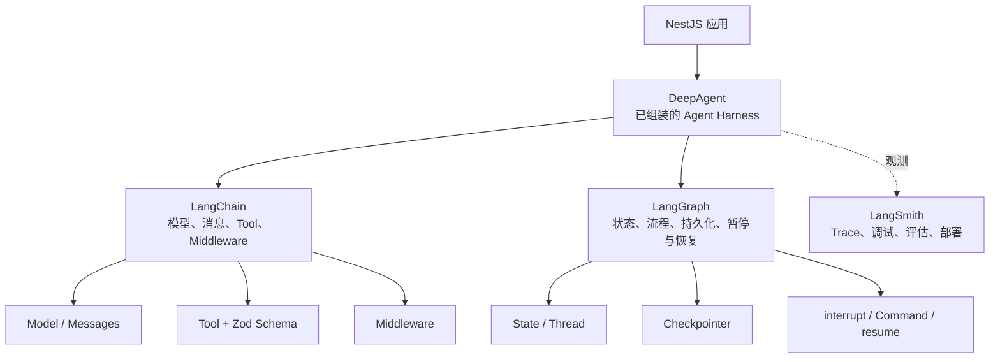

# AI Agents 开发实践 · 学习路线

本文只记录《AI Agents 开发实践》的**教材渐进路线**。教材继续从 LangChain、LangGraph 与向量/RAG 的底层能力出发，最后在第十四、十五章进入 DeepAgent 与迁移实践。

- **课本**：[`docs/AI Agents 开发实践/`](./AI%20Agents%20开发实践/)
- **工程**：按章从零在本仓库生成（Bun monorepo：`clients/` / `services/` / `packages/`）
- **对照参考**（只读）：[Cookieboty/autix-demo](https://github.com/Cookieboty/autix-demo) 各章 `feat/*` 分支
- **旧 Nest 练习文档**：已移至 [`docs/archive/`](./archive/)，不再作为主线

学习方式：读章 → 按章内步骤/Prompt 在本仓实现 → 对照验收点 → 勾选进度 → 进入下一章。

## 两条路线如何选择

| 路线 | 入口 | 适合目标 | 实现目录 |
| --- | --- | --- | --- |
| 教材渐进路线 | 本文下方章节索引 | 理解 LangChain/向量基础 → LangGraph → RAG → DeepAgent 的演进与迁移 | 既有教材配套工程 |
| DeepAgent-first 工程路线 | [DeepAgent-first 实践指南](./deepagent-first/README.md) | 不先手写一套 Chain/StateGraph，直接用 DeepAgent Harness 建设当前项目 | `services/deepagent-api`、`clients/deepagent-web`、`packages/deepagent-contracts` |

两条路线并不冲突。DeepAgent 建立在 LangChain 与 LangGraph 的基础能力之上；“DeepAgent-first”表示工程从 Harness 起步，而不是删除或否认底层依赖。下方勾选框仅表示教材路线的学习进度，新工程的实现与验证状态以独立指南为准。

当前工程针对锁定依赖采用 `streamEvents` v2 raw-event 适配；这是失败路径稳定性上的工程兼容决策，不改变教材对 DeepAgent/LangGraph 原理和其他事件 API 的讲解。具体原因与回归测试见 DeepAgent-first 指南。

## DeepAgent-first 的学习心智模型

已经能借助 AI 使用 DeepAgent 实现基础功能，甚至完成人工介入，并不代表需要立即从头通读 DeepAgent、LangChain 和 LangGraph 三套文档。更有效的方式是：

> 继续使用 DeepAgent 建设实际功能，同时补齐 LangChain 基础；遇到状态持久化、人工介入、暂停恢复和自定义流程时，再定向学习 LangGraph。

三者不是互相替代的平行框架，而是不同抽象层级：



DeepAgent 是已经组装好的 Agent Harness；LangChain 提供模型、消息、工具和中间件等基础组件；LangGraph 提供有状态、可持久化、可暂停恢复的运行能力；LangSmith 负责 Trace、调试、评估和托管等工程能力。

### 陌生 API 的来源地图

AI 生成的示例经常跨越多个抽象层，因此会出现“API 突然冒出来”的感觉。先根据 import 判断 API 属于哪一层，再阅读对应层的文档。

| Import 来源 | 主要职责 |
| --- | --- |
| `deepagents` | 规划、文件系统、子 Agent、记忆等已经组装好的能力 |
| `langchain` | `tool()`、`createAgent()`、Middleware 等常用 Agent API |
| `@langchain/core` | Message、模型接口、Runnable 等基础抽象 |
| `@langchain/langgraph` | `StateGraph`、`Command`、`interrupt()`、持久化和恢复 |
| `@langchain/openai` 等 Provider 包 | 不同模型厂商的具体实现 |
| LangSmith | Trace、调试、评估和托管，不承载主要业务逻辑 |

遇到陌生 API 时，不应仅根据名称猜测。至少确认以下问题：

1. 这个 API 来自哪个 npm 包？
2. 它适用于哪个具体版本？
3. 它属于 DeepAgent、LangChain 还是 LangGraph？
4. 它的输入、返回值和生命周期是什么？
5. 是否存在对应版本的官方 TypeScript 文档？

让 AI 解释代码时，可以直接使用下面的约束：

```text
请为每个陌生 API 标注：
1. npm 包与完整 import；
2. 适用版本；
3. 所属层级（DeepAgent、LangChain 或 LangGraph）；
4. 输入、返回值及其在 Agent 生命周期中的作用；
5. 对应的官方 TypeScript 文档链接。
如果无法确认当前版本存在，请明确说明，不要根据旧版本或 Python API 猜测。
```

尤其注意不要混用 Python 与 TypeScript API、旧版与新版 LangChain API、LangGraph 原生 API 与 DeepAgent 包装 API。

## DeepAgent-first 补课路线

### 第一阶段：补齐 LangChain 的四个基础概念

配套可执行练习：[第一阶段：LangChain 四个基础概念](../services/deepagents-in-action/ch01-langchain-foundations/README.md)。该练习不使用 `createAgent()` 或 `createDeepAgent()`，通过手写 Tool Calling 循环展示每条 Message 的产生者、Model 和 Tool 的输入输出、循环停止条件，并提供逐题回答模板与离线测试。

暂时不用扩展到 RAG、向量数据库和大量第三方集成，只学习：

1. **Message**：`HumanMessage`、`AIMessage`、`ToolMessage` 分别由谁产生。
2. **Model**：模型接收什么输入，返回什么结构。
3. **Tool**：工具名称、描述、Zod 参数和执行结果。
4. **Agent loop**：模型选择 Tool，系统执行 Tool，再将结果交回模型继续推理。

建议脱离 DeepAgent，手写一个最小 Agent：

```text
用户问题
  → 模型判断是否调用 Tool
  → Tool 查询数据
  → ToolMessage 返回结果
  → 模型生成最终答案
```

完成标准：看到一次 Agent 执行记录时，能够解释每条 Message 是谁产生的，以及 Tool 为什么被调用。

### 第二阶段：回到 DeepAgent，识别自动组装的能力

配套可执行练习：[第二阶段：观察 DeepAgent Harness](../services/deepagents-in-action/ch03-harness-observation/README.md)。它使用与第一阶段相同的业务 Tool，但把手写循环替换为 `createDeepAgent()`，并逐步打印 Message、Tool Call、Todo 和虚拟文件状态；讲义给出了五个观察问题的回答标准及 LangSmith Trace 核验方法。

重点观察 `createDeepAgent()` 自动添加或管理的内容：

- 默认提示词与规划能力
- Todo 和文件系统工具
- Context summarization
- Subagent
- Backend
- Memory
- Human-in-the-loop Middleware

每增加一项配置，都通过 LangSmith Trace 回答：

1. 模型收到了哪些消息？
2. 当前暴露了哪些工具？
3. 工具参数由谁生成？
4. Tool 执行后返回了什么？
5. Agent 为什么继续循环、暂停或停止？

### 第三阶段：用原生 LangGraph 重写一次人工介入

配套可执行练习：[第三阶段：原生 LangGraph 人工介入](../services/deepagents-in-action/ch05-native-langgraph-hitl/README.md)。该练习不使用 `createDeepAgent()`，通过本地后端与浏览器审批页面分别演示批准、修改和拒绝；审批前不产生副作用，并用测试验证不同 `thread_id` 的 checkpoint 隔离。

这是理解 DeepAgent 人工审批能力最关键的练习。暂时不用 DeepAgent，直接实现一个最小流程：

```text
生成操作建议
  → interrupt() 暂停
  → 人工批准、修改或拒绝
  → Command({ resume: ... })
  → 继续执行
```

只需要集中学习以下概念：

- State 与 Node
- `Command`
- Checkpointer
- `thread_id`
- `interrupt()`
- `Command({ resume })`

人工介入能够跨请求、跨进程或隔一段时间后恢复，依赖的是一整套协作机制：

```text
interrupt
  → Checkpointer 保存 State
  → thread_id 标识本次执行
  → Command({ resume }) 提交人工决定
  → 从暂停位置继续
```

因此，理解人工介入时不要只研究 `interrupt()` 的函数签名，还要同时理解状态保存、线程标识和恢复协议。

### 第四阶段：接入 NestJS 的工程边界

理解底层运行机制后，再把 Agent 放回应用架构：

```text
Controller
├── POST /agents/:id/runs       开始运行
├── GET  /threads/:id           查询状态
└── POST /threads/:id/resume    提交人工审批

Service
├── 创建或调用 Agent
├── 保存 thread_id
├── 处理 interrupt
└── 恢复执行

Infrastructure
├── 持久化 Checkpointer
├── Streaming
└── LangSmith Trace
```

工程化阶段重点回答：

- `thread_id` 如何与用户、业务实体和会话关联？
- 服务重启后是否仍能恢复？
- 重复审批或重试是否会造成副作用重复执行？
- 哪些 Tool 必须人工批准？
- `interrupt()` 前后的代码在恢复时是否会重新执行？
- 并发请求如何避免重复恢复同一个线程？

### 推荐的实际推进顺序

```text
现有 DeepAgent 项目
  → 补 LangChain：Message + Model + Tool + Agent loop
  → 将一个人工介入功能用原生 LangGraph 重写
  → 理解 Checkpointer + thread_id + interrupt/resume
  → 回到 DeepAgent 继续完成实际项目
```

判断是否真正理解这套技术栈，不取决于记住了多少 API，而取决于能否回答：

> 当前状态保存在哪里？下一步由谁决定？为什么能够暂停？恢复时凭什么找到原来的执行？

能回答这四个问题，就已经建立了贯穿 DeepAgent、LangChain 与 LangGraph 的核心心智模型。

进一步阅读：

- [Deep Agents overview（TypeScript）](https://docs.langchain.com/oss/javascript/deepagents/overview)
- [Thinking in LangGraph（TypeScript）](https://docs.langchain.com/oss/javascript/langgraph/thinking-in-langgraph)
- [LangChain Build overview](https://docs.langchain.com/build-overview#typescript)

## 当前学习进度

- [x] 序章：站在范式之变的十字路口
- [x] 第一章：把模型变成能力
- [x] 第二章：搭建智能体的工程底座
- [ ] 第 2.5 章：用 AI 接管工程化开发
- [ ] 第三章：LangChain 起手——第一条服务端能力链路
- [x] 第四章：LangChain 进阶——记忆、工具与多 Agent
- [ ] 第五章：从 Mock 到生产——数据库与向量化落库
- [ ] 第六章：让 AI 做更懂你的交互
- [ ] 第七章：Agent 推理的三层决策机制
- [ ] 第八章：LangGraph 单 Agent 图实战
- [ ] 第九章：LangGraph Multi-Agent 实战
- [ ] 第十章：Token 经济学
- [ ] 第十一章：RAG
- [ ] 第十二章：MCP
- [ ] 第十三章：Skills
- [x] 第十四章：DeepAgent（Harness）
- [ ] 第十五章：DeepAgent（长链任务与自主规划）
- [ ] 第十六章：可观测性
- [ ] 第十七章：评估流水线
- [ ] 第十八章：安全、沙箱与权限隔离
- [ ] 第十九章：工程化交付——CI/CD
- [ ] 第二十章：满血版 MVP
- [ ] 终章：复盘与前瞻
- [ ] 面试篇：Agent 基础与编排

当前下一步：阅读并实践 **第十五章**（DeepAgent 长链任务与自主规划）。

## 章节索引

| 进度 | 章节 | 课本 | 官方对照分支（可选） |
| --- | --- | --- | --- |
| [x] | 序章 | [1-序章](./AI%20Agents%20开发实践/1-序章：站在范式之变的十字路口.md) | — |
| [x] | 第一章 | [2-第一章](./AI%20Agents%20开发实践/2-第一章：把模型变成能力.md) | — |
| [x] | 第二章 | [3-第二章](./AI%20Agents%20开发实践/3-第二章：搭建智能体的工程底座.md) | [feat/foundation](https://github.com/Cookieboty/autix-demo/tree/feat/foundation) |
| [ ] | 第 2.5 章 | [4-第2.5章](./AI%20Agents%20开发实践/4-第2.5章：用%20AI%20接管工程化开发：从工程底座到能力链路.md) | [feat/user-system](https://github.com/Cookieboty/autix-demo/tree/feat/user-system) |
| [ ] | 第三章 | [5-第三章](./AI%20Agents%20开发实践/5-第三章：LangChain%20起手——搭建第一条服务端能力链路.md) · [API 流程速查](./5a-第三章附录：LangChain%20编程%20API%20使用流程速查.md) | — |
| [x] | 第四章 | [6-第四章](./AI%20Agents%20开发实践/6-第四章：LangChain%20进阶——记忆、工具与多%20Agent.md) | — |
| [ ] | 第五章 | [7-第五章](./AI%20Agents%20开发实践/7-第五章：从%20Mock%20到生产——数据库设计与向量化落库.md) | — |
| [ ] | 第六章 | [8-第六章](./AI%20Agents%20开发实践/8-第六章：让%20AI%20做更懂你的交互.md) · [Ch6 UI Runbook](./chat/ch6-ui-runbook.md) · [Spec](./superpowers/specs/2026-08-04-langchain-ch6-ai-ui-design.md) · [Plan](./superpowers/plans/2026-08-04-langchain-ch6-ai-ui.md) | 本仓 `feat/LangChain-Advanced-UI` · 协议参考 [feat/ai-ui](https://github.com/Cookieboty/autix-demo/tree/feat/ai-ui) |
| [ ] | 第七章 | [9-第七章](./AI%20Agents%20开发实践/9-第七章：Agent%20推理的三层决策机制：路由、执行与优化.md) | — |
| [ ] | 第八章 | [10-第八章](./AI%20Agents%20开发实践/10-第八章：LangGraph%20单%20Agent%20图实战——路由、循环与质量闭环.md) | [feat/LangGraph](https://github.com/Cookieboty/autix-demo/tree/feat/LangGraph) |
| [ ] | 第九章 | [11-第九章](./AI%20Agents%20开发实践/11-第九章：LangGraph%20Multi-Agent%20实战.md) | [feat/LangGraph](https://github.com/Cookieboty/autix-demo/tree/feat/LangGraph) |
| [ ] | 第十章 | [12-第十章](./AI%20Agents%20开发实践/12-第十章：Token%20经济学：在%20AI%20能力与运行成本之间寻找平衡.md) | [feat/token](https://github.com/Cookieboty/autix-demo/tree/feat/token) |
| [ ] | 第十一章 | [13-第十一章](./AI%20Agents%20开发实践/13-第十一章：RAG——让AI更懂你的业务.md) | [feat/rag](https://github.com/Cookieboty/autix-demo/tree/feat/rag) |
| [ ] | 第十二章 | [14-第十二章](./AI%20Agents%20开发实践/14-第十二章：MCP——工具调用的操作系统.md) | [feat/mcp](https://github.com/Cookieboty/autix-demo/tree/feat/mcp) |
| [ ] | 第十三章 | [15-第十三章](./AI%20Agents%20开发实践/15-第十三章：Skills——把最佳实践沉淀为能力资产.md) | [feat/skills](https://github.com/Cookieboty/autix-demo/tree/feat/skills) |
| [x] | 第十四章 | [16-第十四章](./AI%20Agents%20开发实践/16-第十四章：DeepAgent——一个开箱即用的%20Agent%20Harness.md) | 本仓 `feat/DeepAgent` · 官方对照 [feat/deepagents](https://github.com/Cookieboty/autix-demo/tree/feat/deepagents) |
| [ ] | 第十五章 | [17-第十五章](./AI%20Agents%20开发实践/17-第十五章：DeepAgent——长链任务与自主规划.md) | [feat/deepagents](https://github.com/Cookieboty/autix-demo/tree/feat/deepagents) |
| [ ] | 第十六章 | [18-第十六章](./AI%20Agents%20开发实践/18-第十六章：可观测性——你不能优化你看不见的东西.md) | [feat/observability](https://github.com/Cookieboty/autix-demo/tree/feat/ch16-observability) |
| [ ] | 第十七章 | [19-第十七章](./AI%20Agents%20开发实践/19-第十七章：评估流水线——给%20Agent%20装质检线.md) | [feat/eval](https://github.com/Cookieboty/autix-demo/tree/feat/ch17-eval) |
| [ ] | 第十八章 | [20-第十八章](./AI%20Agents%20开发实践/20-第十八章：安全、沙箱与权限隔离.md) | [feat/security](https://github.com/Cookieboty/autix-demo/tree/feat/ch18-security) |
| [ ] | 第十九章 | [21-第十九章](./AI%20Agents%20开发实践/21-第十九章：工程化交付——AI%20应用的%20CI／CD.md) | [feat/cicd](https://github.com/Cookieboty/autix-demo/tree/feat/ch19-cicd) |
| [ ] | 第二十章 | [22-第二十章](./AI%20Agents%20开发实践/22-第二十章：满血版%20MVP：端到端生产链路.md) | [feat/full-pipeline](https://github.com/Cookieboty/autix-demo/tree/feat/ch20-full-pipeline) |
| [ ] | 终章 | [23-终章](./AI%20Agents%20开发实践/23-终章：复盘与前瞻.md) | — |
| [ ] | 面试篇 | [24-面试篇](./AI%20Agents%20开发实践/24-面试篇：Agent%20基础与编排.md) | — |

## 每章节奏

1. 打开对应课本，读完「验收点 / 演进路线」。
2. 在本仓按步骤或章内 Prompt 实现（卡住时对照官方分支，不要整仓覆盖本仓）。
3. 用章内命令、URL 或测试完成验收。
4. 回到本文勾选进度，更新「当前下一步」。

## 环境预期（从第二章起）

书中工程底座大致依赖：

- Bun（workspaces / 脚本）
- Turbo（任务编排）
- Next.js（`clients/`）
- NestJS（`services/`）
- Docker Compose（多服务联调）
- TypeScript monorepo 共享包（`packages/contracts` 等）

具体版本与目录以第二章正文为准；本仓在完成第二章前可以没有任何应用代码。
